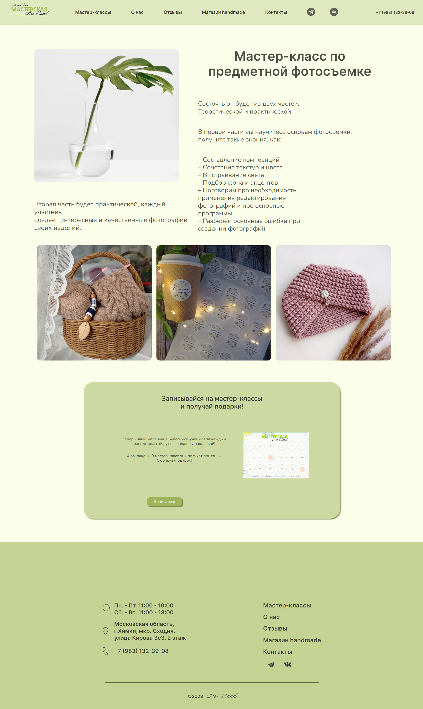
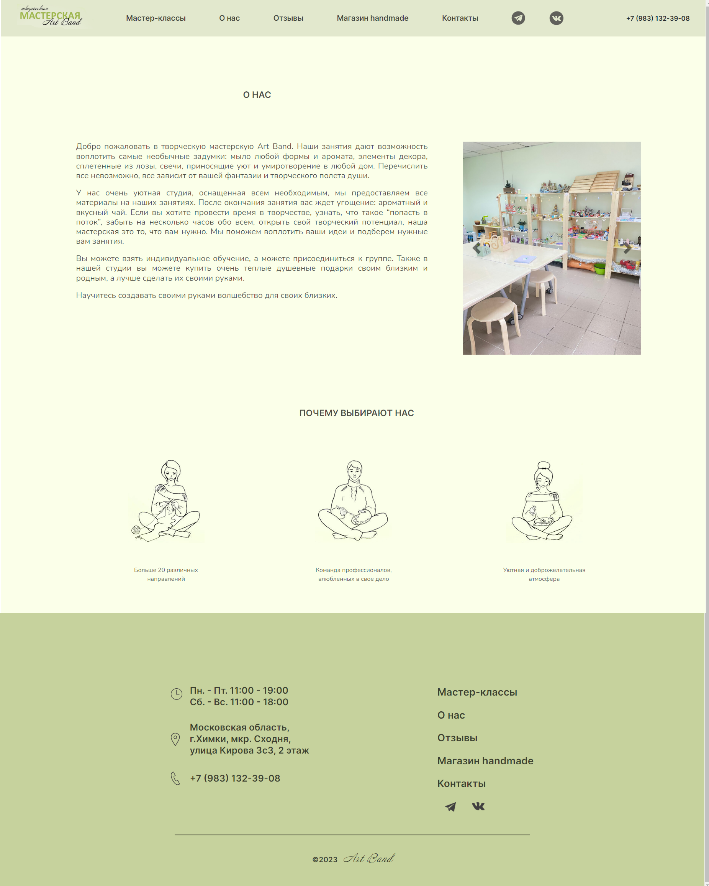

<h1>Art Band</h1>
<p>Website of the art workshop in Khimki</p>

<p align="left"></p>
<p align="left"></p>
<p align="left"></p>
<p align="left"></p>

<h2>How to make it work?</h2>

1.  Clone the repo:

        git clone https://github.com/AnzhelaPopova/Art_Band

2.  Install dependencies using:

       ```
        npm install
       ```
3.  Run:
       ```
        npm start
       ```
<h2>Technologies:</h2>
<p align="left">
<a href="https://www.w3schools.com/css/" target="blank" >  </a>
<a href="https://www.w3.org/html/" target="blank">  </a>
<a href="https://git-scm.com/" target="blank">  </a>
<a href="https://sass-lang.com" target="blank" >  </a>
<a href="https://getbootstrap.com" target="blank">  </a> 

<h2>Result:</h2>
<a href="https://anzhelapopova.github.io/Art_Band/">Click here ✨</a>

